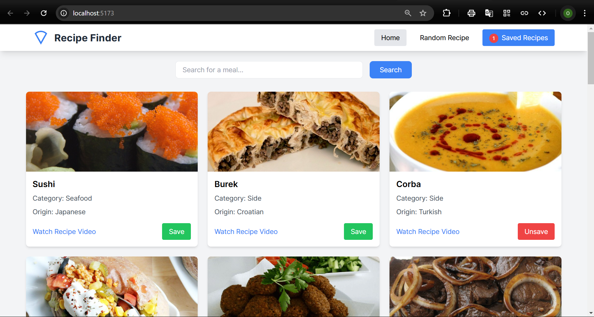
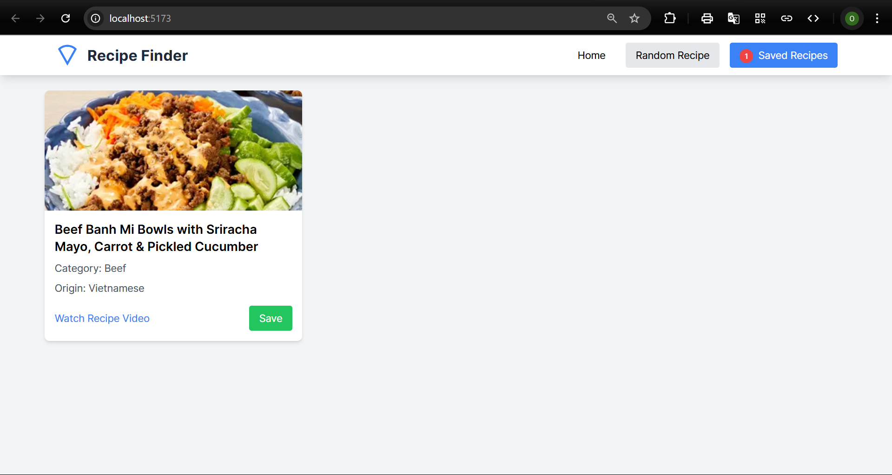
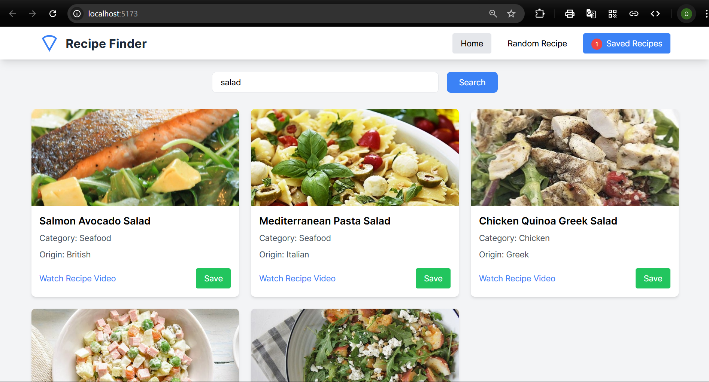

# Recipe Finder App

A React application for discovering and saving recipes, built with TypeScript and Tailwind CSS.

## Features

- Search for recipes
- View random recipes
- Save favorite recipes
- Watch recipe videos
- Responsive design

## Screenshots

### Home Page


### Random Recipe


### Search Results


## Technologies Used

- React
- TypeScript
- Tailwind CSS
- TheMealDB API

## Getting Started

1. Clone the repository

```bash
git clone https://github.com/onesmuskipchumba0/recipe-react-app.git
```
2. Install Dependencies
```bash
cd recipe-react-app
npm install
```
3. Start the development server
```bash
npm run dev
```
4. Open [http://localhost:5173](http://localhost:5173) in your browser

## Contact

- GitHub: [@onesmuskipchumba0](https://github.com/onesmuskipchumba0)
- Email: onesmuskipchumba5@gmail.com

## License

This project is licensed under the MIT License - see the [LICENSE](LICENSE) file for details.
